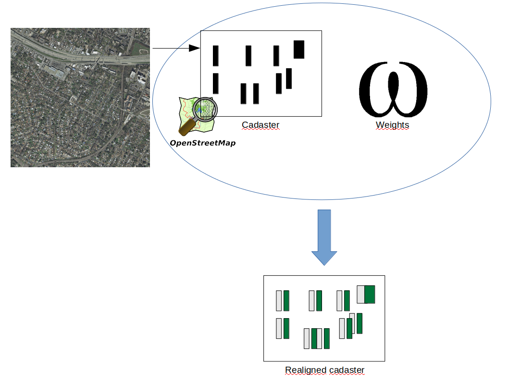

# Aligning Cadasters with Satellite Images

### Intro

Airbus needs cadasters as accurate as possible in order to build 3D maps.
Most of towns have their own cadasters with building locations.

<p align="center">
    

### Problem

These cadasters often contain errors due to several factors:
- Operational mistakes: some of these maps are created by individuals and are thus subject to human errors
- Atmospheric issues: some of these maps are created from satellite images and errors can rise because of atmosphere condition
- Update issue: these cadasters can be outdated if new buildings appear

### Objective

The objective of this project is to implement a model allowing to realign wrong cadasters with true building locations.

### Deep learning / CNN
In image registration, deep learning models allow to learn the displacement of a misaligned image to be correctly aligned. This is done through supervised learning using aligned images as labels.
Convolutional neural networks can usually efficiently detect pixel changes and can thus easily spot edges. This is especially useful in building detection.

### Workflow
Inference:
Input: satellite image
Output: misaligned polygons (from OSM) and aligned polygons
Training:
Input: satellite images and aligned polygons (labels)
Output: model weights

### Tools
Libraries that are specific to image processing:
- GDAL: allows the use of various image formats and has many functions for transformations and projections
- PyProj: has many transformation functions. We use the projection in EPSG space to get building coordinates
- Overpy: has an API to request cadasters from Open Street Map
Library that is specific to deep learning:
- Tensorflow: used to build the CNN model

### Infrastructure
Because of the numerous specific libaries to install and to avoid version issues, it is better to work using an appropriate environment: 
- Docker container: a container allows to be environment-friendly and not install any library locally
- Virtual environment: Conda allows the use of virtual environment in order to avoid installing any library locally

It appeared that using GPU is easier with virtual environment.

We chose to set a virtual environment with all required libraries installed with pip excepted tensorflow where we used conda installation:

```
conda install tensorflow-gpu
```

Not specifying the version allowed conda to choose right version to install according to associated packages:

tensorflow-gpu==1.1

cuda==9.0

cudnn==7.4.1

### Training
Important: for the training phase, OSM are considered aligned (ground truth)

Preprocessing

- OSM request to get polygons

Training

- Displaced polygons are created from OSM ones
- Model is instanciated (graph is built)
- Training is done to learn the displacement → storage of weights

<p align="center">
    

### Inference
Important: OSM are considered ill-aligned
- OSM request to get polygons
- Use weights to infer new polygons better aligned

<p align="center">
    

### Model
Multi-resolutions
Multi-tasks

# Aligning and Updating Cadaster Maps with Remote Sensing Images

<p align="center">
    
</p>

This is the official code for the papers:

**Noisy Supervision for Correcting Misaligned Cadaster Maps Without Perfect Ground Truth Data**\
[Nicolas Girard](https://www-sop.inria.fr/members/Nicolas.Girard/),
[Guillaume Charpiat](https://www.lri.fr/~gcharpia/),
[Yuliya Tarabalka](https://www-sop.inria.fr/members/Yuliya.Tarabalka/)\
IGARSS 2019\
**[[Paper](https://www-sop.inria.fr/members/Nicolas.Girard/pdf/Girard_2019_IGARSS_paper.pdf)]**

And:

**Aligning and Updating Cadaster Maps with Aerial Images by Multi-Task, Multi-Resolution Deep Learning**\
[Nicolas Girard](https://www-sop.inria.fr/members/Nicolas.Girard/),
[Guillaume Charpiat](https://www.lri.fr/~gcharpia/),
[Yuliya Tarabalka](https://www-sop.inria.fr/members/Yuliya.Tarabalka/)\
ACCV 2018\
**[[Paper](https://www-sop.inria.fr/members/Nicolas.Girard/pdf/Girard_2018_ACCV_paper.pdf)] [[Supplementary materials](https://www-sop.inria.fr/members/Nicolas.Girard/pdf/Girard_2018_ACCV_suppmat.pdf)]**

It can be adapted to implement the method of our previous paper:

**Multimodal image alignment through a multiscale chain of neural networks with application to remote sensing**\
[Armand Zampieri](https://www.linkedin.com/in/armand-zampieri-43a177ab/?locale=en_US),
[Guillaume Charpiat](https://www.lri.fr/~gcharpia/),
[Nicolas Girard](https://www-sop.inria.fr/members/Nicolas.Girard/),
[Yuliya Tarabalka](https://www-sop.inria.fr/members/Yuliya.Tarabalka/)\
ECCV 2018\
**[[Paper](https://hal.inria.fr/hal-01849389/file/2691.pdf)]**

### Python environment

The code uses a few Python libraries such as Tensorflow, etc.
The docker image
[lydorn/anaconda-tensorflow-geo](docker/lydorn/anaconda-tensorflow-geo) has all the needed dependencies.
See the instructions in the [docker](docker) folder to install docker and build that image.
One the Docker image is built on your system, you can launch one container to execute all the code from this repository.


### Quickstart

In order to align the OSM building annotations of your   own GeoTIFF image using our pre-trained models, follow these instructions:

#### 1 - Download pre-trained networks
4 pe-trained networks are available, one for each downsampling factor 8, 4, 2 and 1.\
You can either: Execute the download script [download_pretrained.py](projects/mapalign/mapalign_multires/download_pretrained.py)\
Or: manually download the zipfile at https://www-sop.inria.fr/members/Nicolas.Girard/downloads/mapalignment/runs.igarss2019.zip,
extract and place the runs folder in the [mapalign_multires](projects/mapalign/mapalign_multires) folder
so that the folder structure is ```projects/mapalign/mapalign_multires/runs.igarss2019```.

#### 2 - Execute script
Execute the [projects/mapalign/mapalign_multires/main.py](projects/mapalign/mapalign_multires/main.py) script: ```python main.py```.
Use ```python main.py -h``` for available options. The most relevant ones are:
- ```--image``` to change the GeoTIFF image used
- ```--shapefile``` to specify the shapefile to align (if not specified, will load and align OSM annotations)
- ```--batch_size``` which you can adapt depending on the available GPU memory
The script will save the aligned annotations in the same folder as the image.


### Train your own models

#### Download datasets

Three datasets are used for training and have individual instructions for downloading in their respective folder:
- [Inria Aerial Image Dataset](data/AerialImageDataset)
- [Aerial imagery object identification dataset for building and road detection, and building height estimation](data/bradbury_buildings_roads_height_dataset)
- [Mapping Challenge from CrowdAI Dataset](data/mapping_challenge_dataset)

#### Pre-process datasets

All scripts for dataset handling relative to the alignment project are located in the [dataset_utils](projects/mapalign/dataset_utils) folder.
See the README in that folder for instructions on dataset pre-processing.

#### Or use your own dataset

If you want to use your own dataset, I suggest you to write a ```read.py``` script based on this one: [read.py](data/AerialImageDataset/read.py).
Then write a ```process_dataset.py``` script based on this one: [preprocess_aerial_image_multires.py](projects/mapalign/dataset_utils/preprocess_aerial_image_multires.py).
The ```process_dataset.py``` script should take as input the images and ground truth data read by the ```read.py``` script and split them in patches that are then stored in TFRecord format for training.
Once the TFRecords are created, you will have to add their path to the [config.py](projects/mapalign/mapalign_multires/config.py) script in the TFRECORDS_DIR_LIST list.

### Perform inference and training of models

The useful scripts and instructions for performing inference and training of the models are in the [mapalign_multires](projects/mapalign/mapalign_multires) folder.

### If you use this code for your own research, please cite:

```
@InProceedings{Girard_2019_IGARSS,
  title = {{Noisy Supervision for Correcting Misaligned Cadaster Maps Without Perfect Ground Truth Data}},
  author = {Girard, Nicolas and Charpiat, Guillaume and Tarabalka, Yuliya},
  booktitle = {IEEE International Geoscience and Remote Sensing Symposium (IGARSS)},
  ADDRESS = {Valencia, Spain},
  year = {2019},
  month = Jul,
}

@InProceedings{Girard_2018_ACCV,
author = {Girard, Nicolas and Charpiat, Guillaume and Tarabalka, Yuliya},
title = {Aligning and Updating Cadaster Maps with Aerial Images by Multi-Task, Multi-Resolution Deep Learning},
booktitle = {The Asian Conference on Computer Vision (ACCV)},
month = {December},
year = {2018}
}

@InProceedings{Zampieri_2018_ECCV,
author = {Zampieri, Armand and Charpiat, Guillaume and Girard, Nicolas and Tarabalka, Yuliya},
title = {Multimodal image alignment through a multiscale chain of neural networks with application to remote sensing},
booktitle = {The European Conference on Computer Vision (ECCV)},
month = {September},
year = {2018}
}
```
